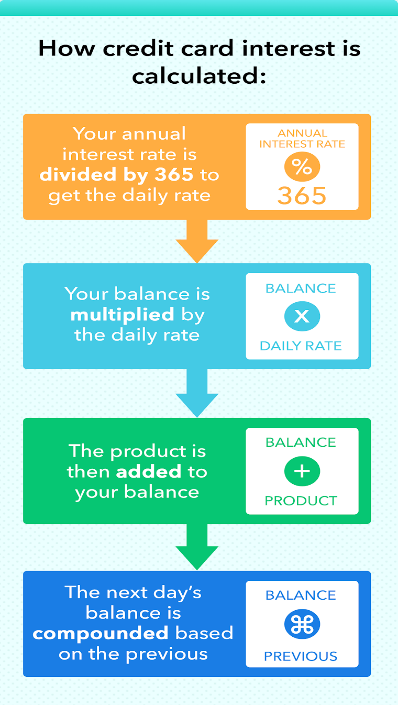

# Key Learnings About the Cost of Money 

- Credit card companies charge you interest unless you pay your balance in full each month.
- Learn to read the fine print! The interest on most credit cards is variable and will change from time to time. 
- Some cards have different interest rates, such as one for purchases and another for cash advances.
- Your credit score can affect the interest rate you'll pay as well as which cards you may qualify to use.
- Most credit cards have variable APRs that will fluctuate with a particular benchmark, such as the prime rate. So, for example, if the prime rate is 4%, and your credit card charges the prime rate plus 12%, your APR will be 16%. Recently, the average APR of credit cards was 19.62%. IT CAN GO HIGHER.
- **The current highest credit card interest rate is 36%**

